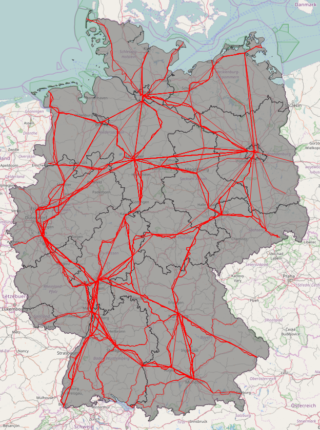
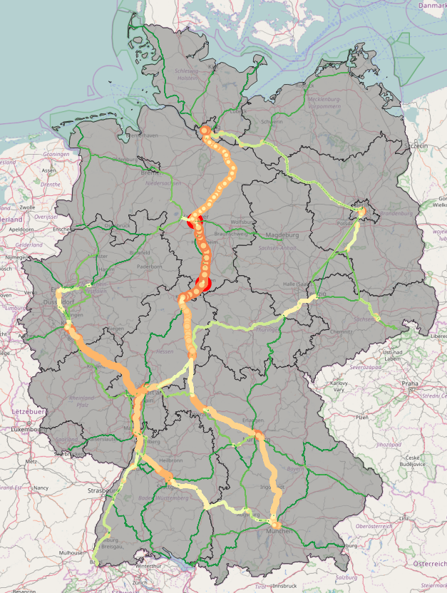
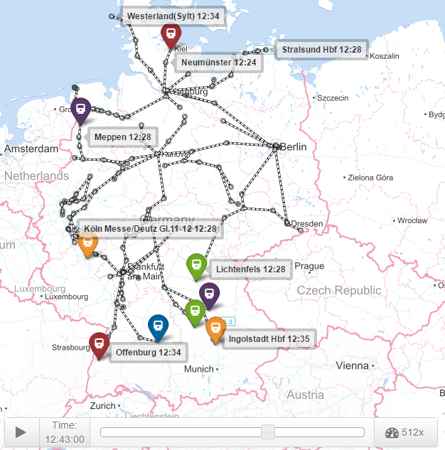
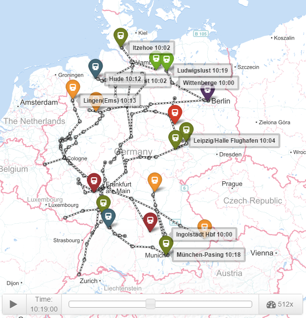

# DB Heartbeat

Deutsche Bahn operates more than 40,000 train runs daily on its more than 33,300 kilometer-long, modern rail network.

Let us think of this rail network as of a blood cirulatory system of the German railways:

We can measure the "blood pressure" - how many trains pass each network segment and - we will notice quite a few critical spots:

We can even run a "stress electrocardiogram" and see how the network performs. We start from Berlinn Main Station and check how far we come in one day:

Now let us see which destinations we can reach from Frankfurt in one day:

